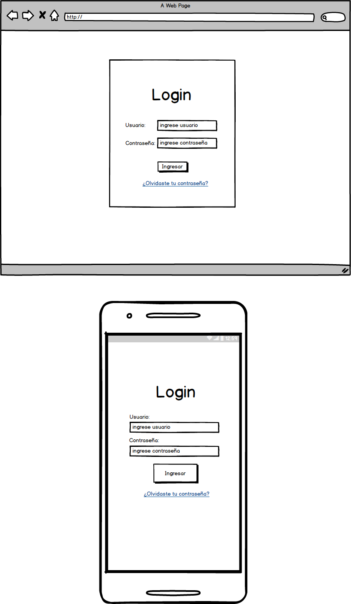
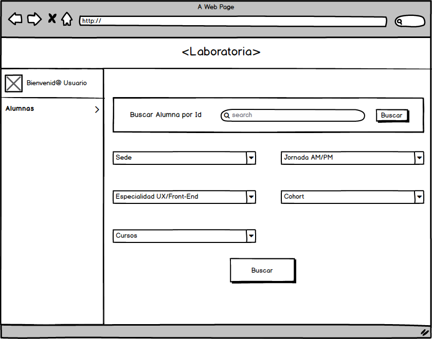
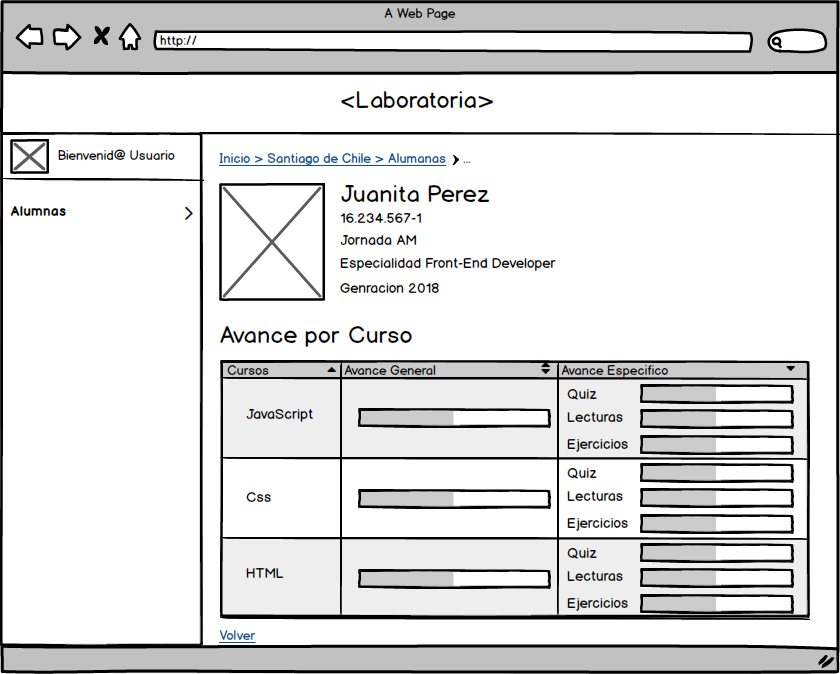
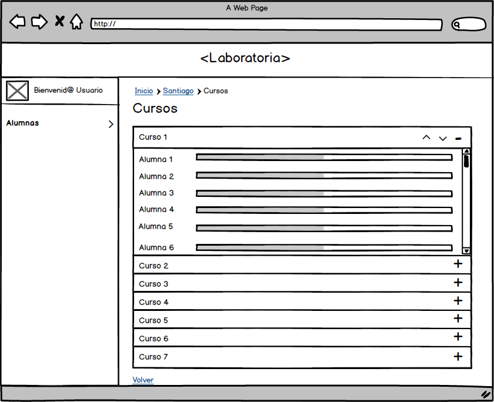

# Data Dashboard

Data Dasboard es un proyecton en el que las Training Managers (TMs) puedan acceder a toda la información de las alumnas de Laboratoria.

## Introducción

Para la realización de este proyecto, se entrevisto a una de las training managers que usaria el data dashboard, Valentina Smith, en la cual se le hicieron preguntas como:

*¿quien seria el usuario principal de esta aplicacion?
*la información que le entregara el data dashboard ¿la compartiria con otras personas?
*¿cual era la información mas importante para ella?

Basandonos en la información dada, diseñamos un bosquejo en el cual se le cosulto a Valentina si se le acomodaba o no, se llego a la siguiente diagramación, diseñado con Balsamiq

El diseño en alta fidelidad se realizo con Figma

